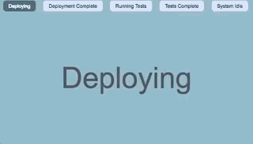

## Example




# Lessons learnt 

### Really cool graphs
http://formidable.com/open-source/victory/gallery/animating-circular-progress-bar/


### Reading configuration from Python
ConfigParser, YAML, or JSON
https://stackoverflow.com/questions/19078170/python-how-would-you-save-a-simple-settings-config-file

#### Read all options for a section
```
dict(Config.items('Section'))
```


# YAML
```
print(yaml.dump({'states':STATES}, default_flow_style=False))
```